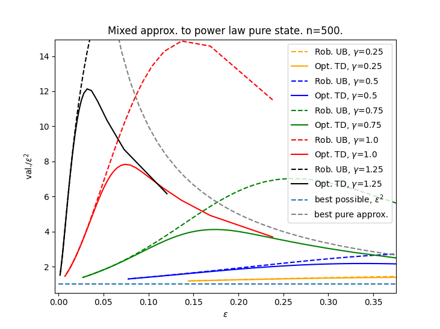

<a href="https://github.com/angusjlowe/rtrunc">rtrunc</a> is a small package to compute randomized truncations of
pure quantum states, optimized with respect to the following distance measures
(as of the current version): (i) trace distance and (ii) robustness.

<p align="center">

</p>

## Installation

First:

```console
git clone https://github.com/angusjlowe/rtrunc.git
```
Then within the cloned directory:

```console
pip install .
```

Or, if you anticipate making changes to the code while using it,
run

```console
pip install -e .
```

Check the (minimal) tests pass by running

```console
python -m pytest tests/
```

If this works, you should be good to go!

## Example usage

All the example code in this section is contained in examples/td_opt_example.py.

### Computing the trace distance
First, we'll import the necessary packages and create a random quantum
state which we'd like to approximate. Here, n is the dimension and k is the
number of non-zero entries in the approximation. We only need the
trace distance module within the rtrunc package for this example, so we
just call the module itself rtrunc.

```python
import numpy as np
from rtrunc import td_optimizer as rtrunc

n, k = 20, 12

# normal, random
v = np.random.normal(0,1,n)

# normalize
v = v/np.linalg.norm(v)
v = -np.sort(-np.abs(v))
```

Next, we can make a new trace distance optimizer object. The optimal
fidelity is immediately available upon instantiation. We can store it for future use.

```python
# instantiate trace distance optimization
tdo = rtrunc.TDOptimizer(k, v)
fid = tdo.fid
print("Optimal fidelity is {:.3f}".format(fid))
```
In this case, we get

```console
Optimal fidelity is 0.172
```

To compute the trace distance and unit vector m corresponding to
the optimal measurement, we need to run:

```python
m,td = tdo.getOptimalTDMeas()
print("Optimal trace distance is {:.3f}")
```
which gives us

```console
Optimal trace distance is 0.089
```
in this case, almost twice as accurate.


### Sampling

Continuing with the above example, we can now sample pure states
from the ensemble corresponding to the optimal density matrix \sigma^*.
For demonstration purposes, let's say we are interested in the observable
serving as the worst-case measurement in discriminating v from its
deterministic truncation. Call this m_det.

```python
# store deterministic truncation
vtrunc = np.concatenate((v[:k],np.zeros(n-k)))
vtrunc = vtrunc/np.linalg.norm(vtrunc)

# compute worst-case measurement
(evals, evecs) = np.linalg.eig(np.outer(v,v)-np.outer(vtrunc, vtrunc))
max_index = np.argmax(evals)
m_det = evecs[:,max_index]
m_det = m_det/np.linalg.norm(m_det)

# store expectation values
true_expec = np.abs(np.dot(m_det, v))**2
det_trunc_expec = np.abs(np.dot(m_det, vtrunc))**2
```

We can sample sparse pure states using randomized truncation to estimate
this observable, and then store the data.

```python
# sample to compute expec. val.
n_samples = 200
expec_samples = []
for j in range(n_samples):
    phi = tdo.sampleOptimalTDState()
    expec = np.abs(np.dot(phi, m_det))**2
    expec_samples.append(expec)

# store data
means = np.array(list(map(lambda x: np.mean(expec_samples[:x]), [*range(1,n_samples+1)])))
stds = np.array(list(map(lambda x: np.std(expec_samples[:x], ddof=1)/np.sqrt(x), [*range(2,n_samples+1)])))
stds = np.concatenate(([0], stds))
xs = np.arange(n_samples)+1
ys = np.abs(means - true_expec)
```
We can plot the difference in expectation compared to that from the
deterministic truncation. In the code below, we also compute the optimal
density matrix using the method getOptimalTDState(). We will return
to this in the next section.

```python
# plot error in estimate from rtrunc against no. of samples
plt.plot(xs, ys, '-', label='rtrunc estimate diff.', color='blue')
plt.fill_between(xs, ys-stds, ys+stds, color='blue', alpha=0.2)

# plot error in estimate from deterministic trunc.
plt.plot(xs, np.ones(n_samples)*np.abs(det_trunc_expec - true_expec), '--', color='black', label='closed-form dtrunc. expec. diff.')

# compute density matrix using closed-form expression
sigma = tdo.getOptimalTDState()

# plot error in estimate according to this density matrix
sigma_expec = np.linalg.trace(np.dot(sigma, np.outer(m_det, m_det)))
plt.plot(xs, np.ones(n_samples)*np.abs(sigma_expec - true_expec), '--', color='red', label='closed-form rtrunc expec. diff.')

# show plot
plt.xlabel('no. of samples')
plt.legend()
title1 = "Estimating worst-case observable for $|v_{1:k}\\rangle$."
title2 = " n={}, k={}.".format(n, k)
plt.title(title1 + title2)
plt.show()
```

This gives:


### Getting the optimal state

The method getOptimalTDState() returns the density matrix corresponding
to the optimal randomized truncation. This method will be costly for large
dimensions since we are generating an nxn matrix, but is useful for checking
the output at smaller dimensions. With n=20 and k=12, we can use it to
visualize the optimal approximation. This leads to the image at the
beginning of this README.

### Generating power law plots

The example code in examples/power_law_example.py demonstrates how one
might use the package to study the behaviour of the optimal approximation
when the sorted entries of v follow a power law. We can plot the quality of
the approximations for various rates of decay as a function of the best pure
trace distance \epsilon.



